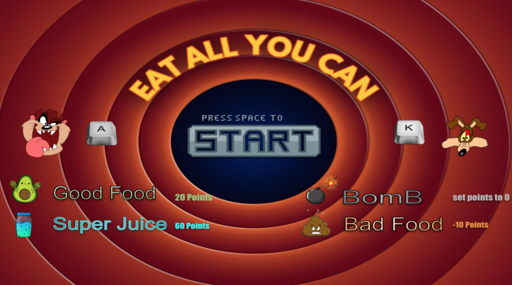
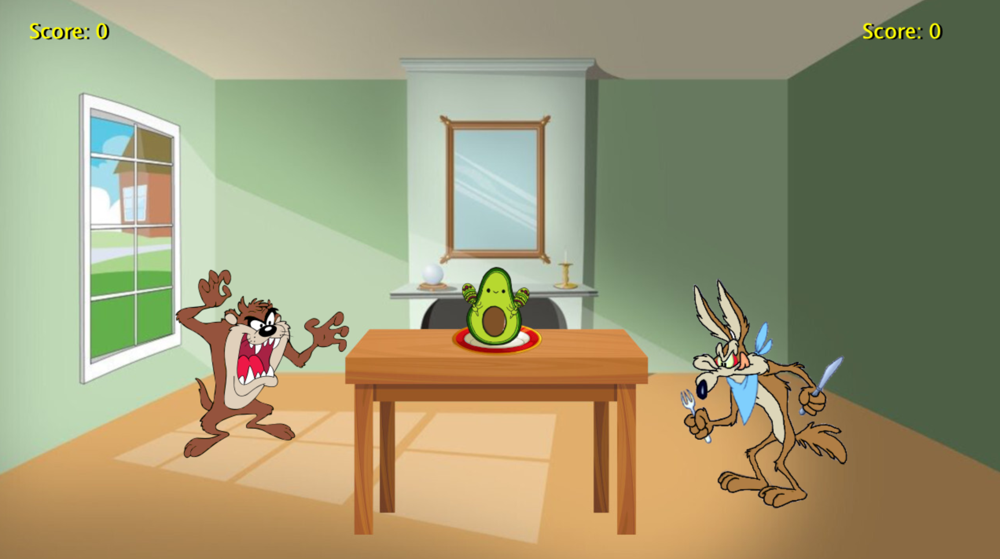
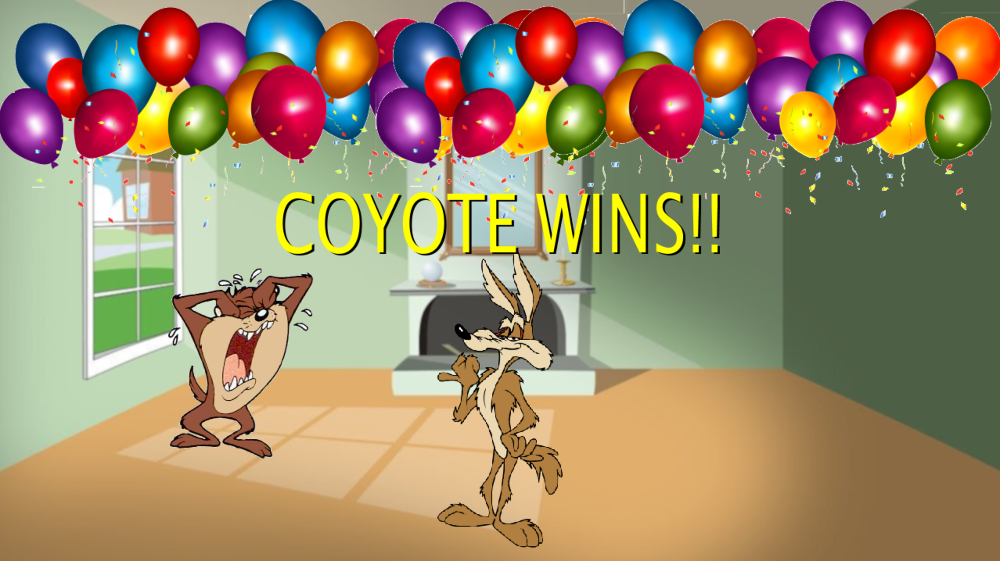

# EpicGame

A 2-player Java arcade game where **Taz** and **Coyote** (Looney Tunes characters) race to grab food items on screen — with animations, sound effects, and a score system.

## Screenshots

**Start Menu**


**Gameplay**


**Game Over**


## Features

- **2-player local multiplayer** — Player 1 controls Taz (`A` key), Player 2 controls Coyote (`K` key)
- **Animated characters** — Frame-by-frame sprite animations for both characters
- **Food items** — Good food, Super Juice, Bad Food and Bombs randomly spawned
- **Sound effects** — Background music, eat sounds, bomb sounds, and a win jingle
- **Score tracking** — Live score display for both players
- **Win / Tie screens** — End-game screens showing the winner or a tie
- **Menu & rules screen** — Start menu with controls and food legend shown before the game

## Tech Stack

| | |
|---|---|
| Language | Java |
| Graphics | SimpleGraphics library |
| Audio | `javax.sound.sampled` |
| IDE | IntelliJ IDEA |
| Build | Ant (`build.xml`) |

## Project Structure

```
epicgame/
├── src/org/academiadecodigo/loopeytunes/EpicGame/
│   ├── Main.java              # Entry point
│   ├── Game.java              # Core game loop, input, scoring, audio
│   ├── Field.java             # Game field and visual layout
│   ├── Menu.java              # Start menu
│   ├── Factorys/
│   │   └── FoodFactory.java   # Randomly spawns food or bombs
│   └── GameObjects/
│       ├── Character.java     # Player character logic and key input
│       ├── Food.java          # Food item representation
│       ├── FoodType.java      # Enum: GOOD / BOMB
│       └── GameObjects.java   # Base game object
├── lib/
│   └── simple-graphics-0.2.1-SNAPSHOT.jar
├── screenshots/
└── build.xml
```

## Setup

### Prerequisites

- Java 8+
- IntelliJ IDEA (or any IDE supporting Ant builds)

### 1. Clone the repo

```bash
git clone git@github.com:jovbcorreia/epicgame.git
cd epicgame
```

### 2. Open in IntelliJ

Open the project folder in IntelliJ IDEA. The `lib/simple-graphics-0.2.1-SNAPSHOT.jar` is already included — make sure it is added to the module classpath.

### 3. Run

Run `Main.java` directly from the IDE.

## How to Play

| Player | Character | Key |
|--------|-----------|-----|
| Player 1 | Taz | `A` |
| Player 2 | Coyote | `K` |

- Press `Space` on the start menu to begin.
- Press your key when food appears on screen to grab it and score points.
- **Good Food** = +20 points
- **Super Juice** = +60 points
- **Bad Food** = -10 points
- **Bomb** = score resets to 0
- After 10 rounds, the player with the highest score wins.
